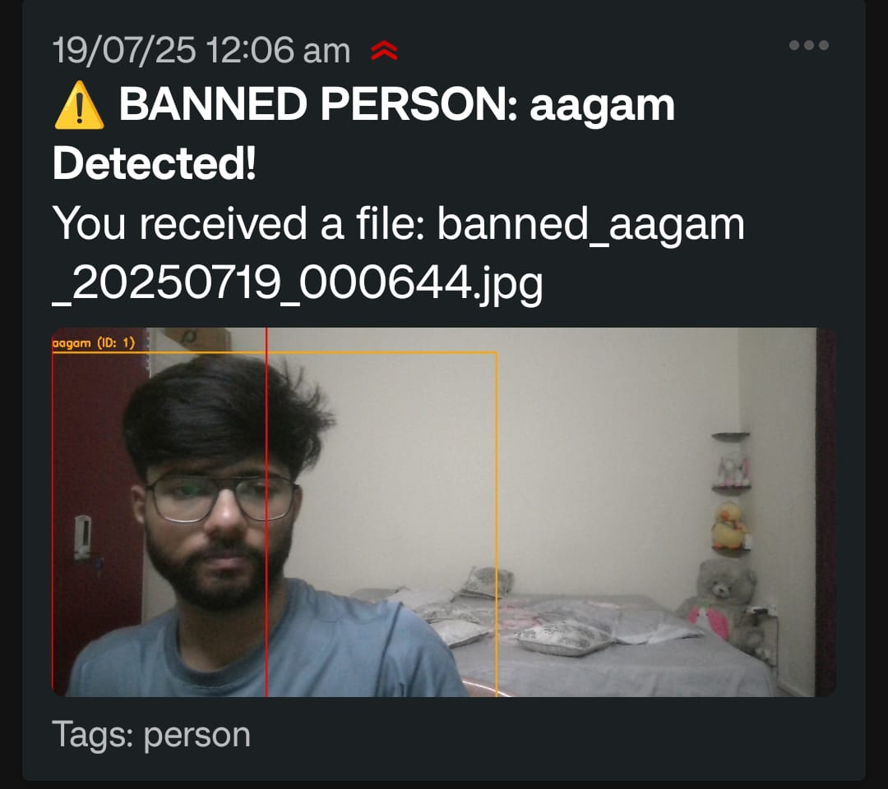

# AI Retail Surveillance & Intelligent Alert System


An advanced, real-time surveillance system that uses computer vision and facial recognition to intelligently monitor restricted areas, identify individuals by status, and trigger role-based alerts with audible sirens and mobile notifications. This project moves beyond simple motion detection, implementing a multi-layered AI pipeline to provide nuanced, actionable security insights.

---

## 🚀 Core Features in Action

The two primary alert scenarios are demonstrated below. The GIFs provide a silent, auto-playing preview. **Click on any GIF to watch the full video with the live siren sound.**

### 1. Banned Person Alert
The system instantly identifies a person on the "banned" list, triggers an audible siren, and sends a high-priority mobile notification with an image of the event.

[](demo/banned-person-demo.mp4)

*<p align="center">The instant mobile notification received for a banned person.</p>*
<p align="center">
  
</p>

### 2. Unknown Person Loitering Alert
When an "unknown" individual remains in a restricted zone for a set duration (10 seconds), the system triggers a loitering alert with a siren and a separate mobile notification. The system correctly ignores "allowed" individuals in the same zone.

[](demo/loitering-alert-demo.mp4)

*<p align="center">The mobile notification received after a loitering event was detected.</p>*
<p align="center">
  
</p>

---

## 🌟 Key Technical Features

*   **Real-Time Video Processing**: Ingests and processes a live webcam feed with minimal latency using a multi-threaded architecture to separate I/O from AI computation.
*   **AI-Powered Person Detection**: Utilizes the **YOLOv8** model to accurately detect all persons in the frame.
*   **Robust Object Tracking**: Employs **DeepSORT** to assign a persistent ID to each detected person, tracking them reliably across frames, even with temporary occlusions.
*   **Intelligent Facial Recognition**:
    *   Builds a database of known faces from image files on startup.
    *   Differentiates between individuals with **Allowed**, **Banned**, and **Known** (neutral) statuses based on their source directory.
*   **Role-Based Alerting System**:
    *   **Instant Alert** for `Banned` individuals entering a restricted zone.
    *   **Loitering Alert** for `Unknown` individuals dwelling in the zone for a configurable time.
    *   `Allowed` and `Known` individuals can move freely without triggering alerts.
*   **Multi-Modal Notifications**: Integrates with the free **ntfy.sh** service to send immediate push notifications (with image evidence) to a mobile device, coupled with an audible siren played locally.
*   **Persistent Event Logging**: Logs all major events (detections, status changes, alerts) to both the console and a permanent `logs/events.log` file for auditing and analysis.
*   **Evidence Capture**: Automatically saves image snapshots of any alert-triggering event and the first sighting of any unknown individual for later review.
*   **Web-Based UI**: Streams the annotated video feed to a simple, clean web interface using **Flask**.

---

## 🛠️ System Architecture

The application is built on a modular pipeline, where the output of one stage becomes the input for the next. This ensures clean, maintainable, and efficient code.


---

## 🚀 Getting Started

### Prerequisites

*   Python 3.9+
*   A webcam
*   The `ntfy` app on your mobile device (available on [Google Play](https://play.google.com/store/apps/details?id=io.heckel.ntfy) and the [App Store](https://apps.apple.com/us/app/ntfy/id1625396347))

### Installation

1.  **Clone the repository:**
    ```bash
    git clone https://github.com/aagamCodeCraft/your-repo-name.git
    cd your-repo-name
    ```

2.  **Install the required Python libraries:**
    *It is highly recommended to use a virtual environment.*
    ```bash
    pip install -r requirements.txt
    ```

### Configuration

1.  **Register Faces**:
    *   Place images of individuals in the `registered_faces/` directory. The system will automatically detect them on startup.
    *   To assign a status, use the following directory structure:
        *   For an allowed person: `registered_faces/allowed/person_a.jpg`
        *   For a banned person: `registered_faces/banned/person_b.jpg`
        *   For a neutral person: `registered_faces/person_c.jpg`

2.  **Set Up Mobile Notifications**:
    *   Open the `ntfy` app on your phone and "subscribe" to a unique, private topic name (e.g., `my-secret-alert-channel-123`).
    *   Open `src/alerting.py` and update the `NTFY_TOPIC` variable with your exact topic name.

### Running the Application

Execute the main application file from the project's root directory:
```bash
python app.py
```
Open your web browser and navigate to `http://127.0.0.1:5000` to see the live feed.

---

## 📂 Project Structure
```
.
├── demo/                   # Contains demo GIFs, videos, and screenshots
├── logs/                   # Stores persistent event logs
├── registered_faces/       # Directory for face images
│   ├── allowed/
│   ├── banned/
│   └── person_c.jpg
├── src/                    # Source code module
│   ├── alerting.py         # Handles sirens and notifications
│   ├── detection.py        # Person detection logic
│   ├── event_logger.py     # Logging configuration
│   ├── face_recognition_util.py # Face loading and recognition
│   ├── tracking.py         # Object tracking logic
│   └── video_stream.py     # Threaded video capture
├── unknown_person_sightings/ # Stores snapshots of new unknown individuals
├── app.py                  # Main application entry point
├── requirements.txt        # Project dependencies
└── README.md               # This file
```

---

## 📄 License

This project is licensed under the MIT License. See the [LICENSE](LICENSE) file for details.

---

Developed by **aagamCodeCraft**.